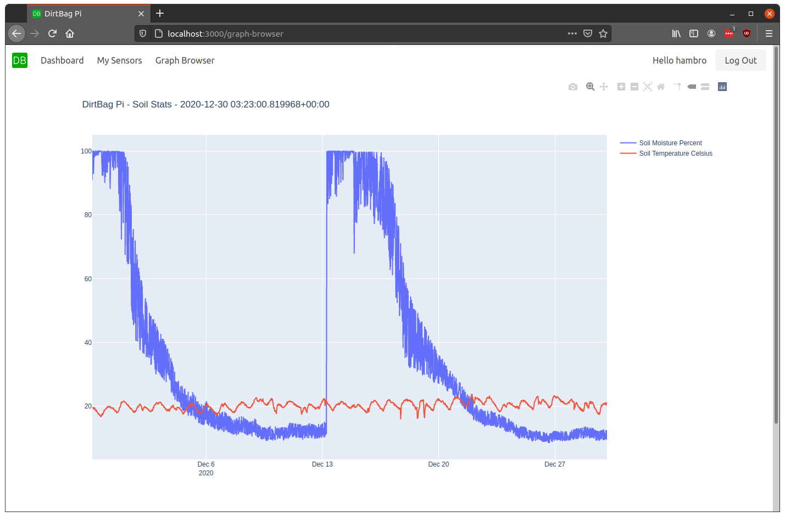

# DirtBag Pi - User Interface

## Overview
The DirtBag Pi UI provides a simple way to manage multiple soil sensors and users in the web browser. The UI is built using React and AWS Amplify.

## Installation and Development
1. Ensure Node and NPM are installed on the machine.
2. Update your `config.json` with the User Pool ID from you AWS Cognito User Pool.
3. Run `npm install`
4. Run `npm start`
4. Your DirtBag Pi UI is now running!

## Current and Upcoming Features
1. (DONE) Registration and login with session persistence
2. (DONE) View graphs as authorized user
3. Manage multiple soil sensors from a single view
4. Automate configuration with DirtBag Pi backend
5. Automate deployment to the cloud
